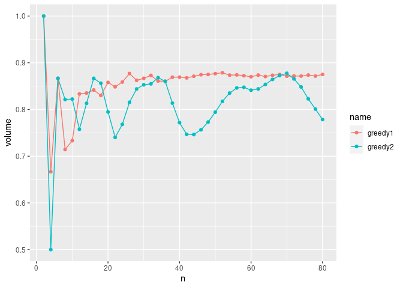

<!-- README.md is generated from README.Rmd. Please edit that file -->

# greedy-maximal-room-squares

<!-- badges: start -->
<!-- badges: end -->

|   n |   t1 |   t2 |       r1 |       r2 |
|----:|-----:|-----:|---------:|---------:|
|   2 |    1 |    1 | 1.000000 | 1.000000 |
|   4 |    4 |    3 | 0.666667 | 0.500000 |
|   6 |   13 |   13 | 0.866667 | 0.866667 |
|   8 |   20 |   23 | 0.714286 | 0.821429 |
|  10 |   33 |   37 | 0.733333 | 0.822222 |
|  12 |   55 |   50 | 0.833333 | 0.757576 |
|  14 |   76 |   74 | 0.835165 | 0.813187 |
|  16 |  101 |  104 | 0.841667 | 0.866667 |
|  18 |  127 |  131 | 0.830065 | 0.856209 |
|  20 |  163 |  151 | 0.857895 | 0.794737 |
|  22 |  196 |  171 | 0.848485 | 0.740260 |
|  24 |  237 |  212 | 0.858696 | 0.768116 |
|  26 |  285 |  265 | 0.876923 | 0.815385 |
|  28 |  326 |  319 | 0.862434 | 0.843915 |
|  30 |  377 |  371 | 0.866667 | 0.852874 |
|  32 |  433 |  424 | 0.872984 | 0.854839 |
|  34 |  483 |  487 | 0.860963 | 0.868093 |
|  36 |  542 |  542 | 0.860317 | 0.860317 |
|  38 |  611 |  572 | 0.869132 | 0.813656 |
|  40 |  678 |  602 | 0.869231 | 0.771795 |
|  42 |  747 |  643 | 0.867596 | 0.746806 |
|  44 |  824 |  706 | 0.871036 | 0.746300 |
|  46 |  905 |  783 | 0.874396 | 0.756522 |
|  48 |  987 |  872 | 0.875000 | 0.773050 |
|  50 | 1074 |  973 | 0.876735 | 0.794286 |
|  52 | 1165 | 1084 | 0.878582 | 0.817496 |
|  54 | 1250 | 1195 | 0.873515 | 0.835080 |
|  56 | 1346 | 1303 | 0.874026 | 0.846104 |
|  58 | 1442 | 1401 | 0.872353 | 0.847550 |
|  60 | 1540 | 1489 | 0.870056 | 0.841243 |
|  62 | 1652 | 1596 | 0.873612 | 0.843998 |
|  64 | 1755 | 1721 | 0.870536 | 0.853671 |
|  66 | 1873 | 1854 | 0.873193 | 0.864336 |
|  68 | 1993 | 1988 | 0.874890 | 0.872695 |
|  70 | 2104 | 2119 | 0.871222 | 0.877433 |
|  72 | 2228 | 2212 | 0.871674 | 0.865415 |
|  74 | 2354 | 2291 | 0.871529 | 0.848204 |
|  76 | 2490 | 2345 | 0.873684 | 0.822807 |
|  78 | 2617 | 2405 | 0.871462 | 0.800866 |
|  80 | 2765 | 2460 | 0.875000 | 0.778481 |

<!-- -->
